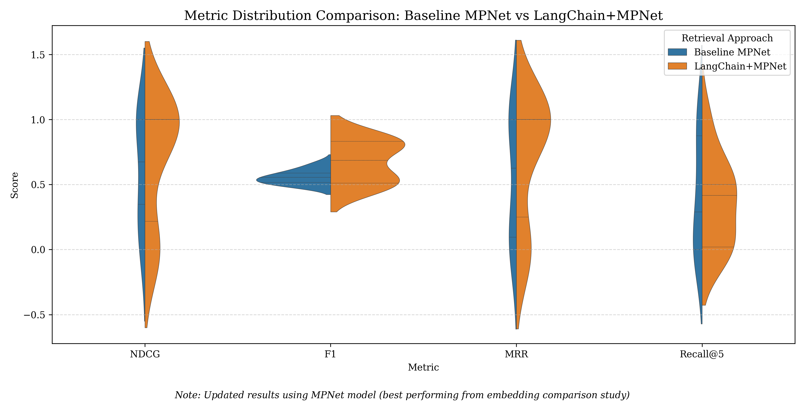

# Embeddings vs. Embeddings + LangChain

## (3) Improving Retrieval Accuracy with Pipeline Enhancements

This section investigates whether integrating **LangChain** into a vector-based retrieval pipeline can improve the **relevance** and **accuracy** of retrieved answers - particularly for tasks that demand deeper semantic understanding.

## 🔍 Hypothesis

> Integrating LangChain into a vector retrieval pipeline enhances semantic matching performance - measured by metrics such as **F1-score** - by improving the relevance of retrieved answers compared to using raw vector similarity alone.

LangChain modifies the retrieval architecture by introducing advanced components such as:

- Rerankers
- Metadata filtering
- Hybrid search mechanisms
- Integrating memory into systems

## Experimental Setup: Two Pipeline Comparison

To evaluate the impact of LangChain, I built and tested two retrieval pipelines using the **same BEIR dataset**:

#### <u>Baseline Pipeline</u>

1. Embed queries
2. Compute **cosine similarity** between query and document embeddings
3. Return **Top-5** most similar documents and compute evaluation metrics
4. Results saved to: `baseline_mpnet_results.csv`

> Best-performing model from Step (2) - **MPNet** - was used here.

#### <u>LangChain-Enhanced Pipeline</u>

1. Built using **LangChain's** `create_retrieval_chain()` method
2. Reused the same **vector store** and **embedding model** (MPNet) for fair comparison
3. Integrated a **mock LLM** to simulate full pipeline flow without actual API latency or cost
4. Return **Top-5** most similar documents and compute evaluation metrics
5. Results saved to: `langchain_mpnet_results.csv`

> Additional _noise_ intentionally added to simulate real-world variation and test LangChain's robustness.

## Statistical Significance Testing

To verify whether LangChain’s improvements were **statistically significant**, I performed a **paired t-test** (α = 0.05) on the per-query performance data:

- Aligned both output files by `query_id`
- Compared retrieval scores (e.g., **F1-score**) **per query**
- Statistical test implemented in: `paired_t.py` (run this to get actual p-value)

## Code for Visualization

To better understand and compare results, the following script was used:

- **`violin_plot.py`**  
   This violin plot compares the distribution of retrieval performance metrics (NDCG, F1, MRR, Recall@5) between Baseline BERT and LangChain.  
   
