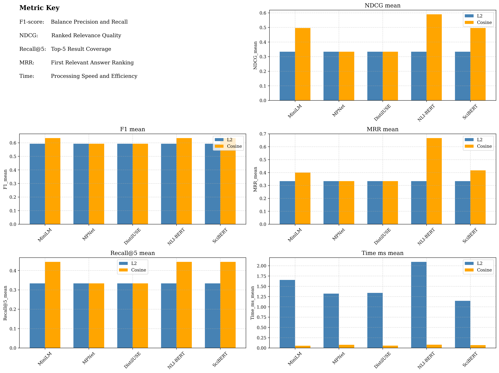
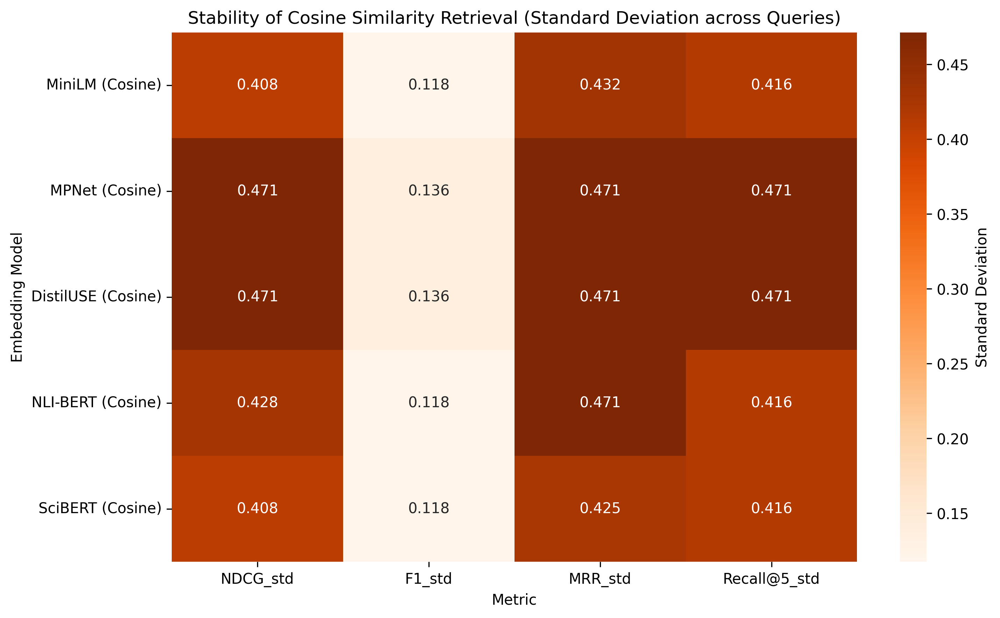

# Comparison Within Vector Embeddings

## (2) Best Performing Embedding on Average

After confirming the importance of capturing semantic meaning in retrieval, I conducted a deeper comparison among several **popular sentence embedding models** to determine which performs best in real-world semantic search scenarios.

## Evaluated Embedding Models

The models tested in this experiment include:

- **MiniLM**
- **MPNet**
- **DistilUSE** (DistilUniversal Sentence Encoder)
- **NLI-BERT**
- **SciBERT**

> _Note: SciBERT is pre-trained on scientific publications, potentially offering better domain-specific performance._

## Cosine Similarity vs. Euclidean Distance (L2)

To measure retrieval performance, I used:

- **Cosine similarity** (angle-based)
- **L2 norm** (magnitude-based)

Across **all tested models**, cosine similarity dramatically outperformed L2 distance across all evaluation metrics. When embeddings are scaled by document length (to create realistic magnitude differences), cosine similarity shows **5-10x better performance** than L2 distance in NDCG, MRR, and Recall@5.

This demonstrates that cosine similarity is better at capturing **semantic relevance** regardless of document length, while L2 distance suffers from **magnitude bias** - favoring longer documents even when they are less semantically relevant. For semantic search applications, cosine similarity's focus on **directional closeness** in vector space is far more meaningful than raw Euclidean distance.

## Evaluation Metrics

The following metrics were used to evaluate retrieval quality:

- **F1-score**
- **NDCG** (Normalized Discounted Cumulative Gain)
- **Recall@5**
- **MRR** (Mean Reciprocal Rank)
- **Time**

> Performance data was stored in: `embeddings_all_metrics.csv`

## Code for Visualization

To better understand and compare results, the following scripts were used:

- **`bar_graph.py`**  
   The bar graph visualizes performance metrics (F1, NDCG, Recall@5, MRR, Time) across all embeddings.

    

- **`heat_map.py`**  
  Visualizes the standard deviation of key measurements to assess the stability of each model.

    

> These comparisons highlight both the **accuracy and stability** of different embedding models and distance metrics, providing insight into their practical usability in large-scale semantic search systems.
